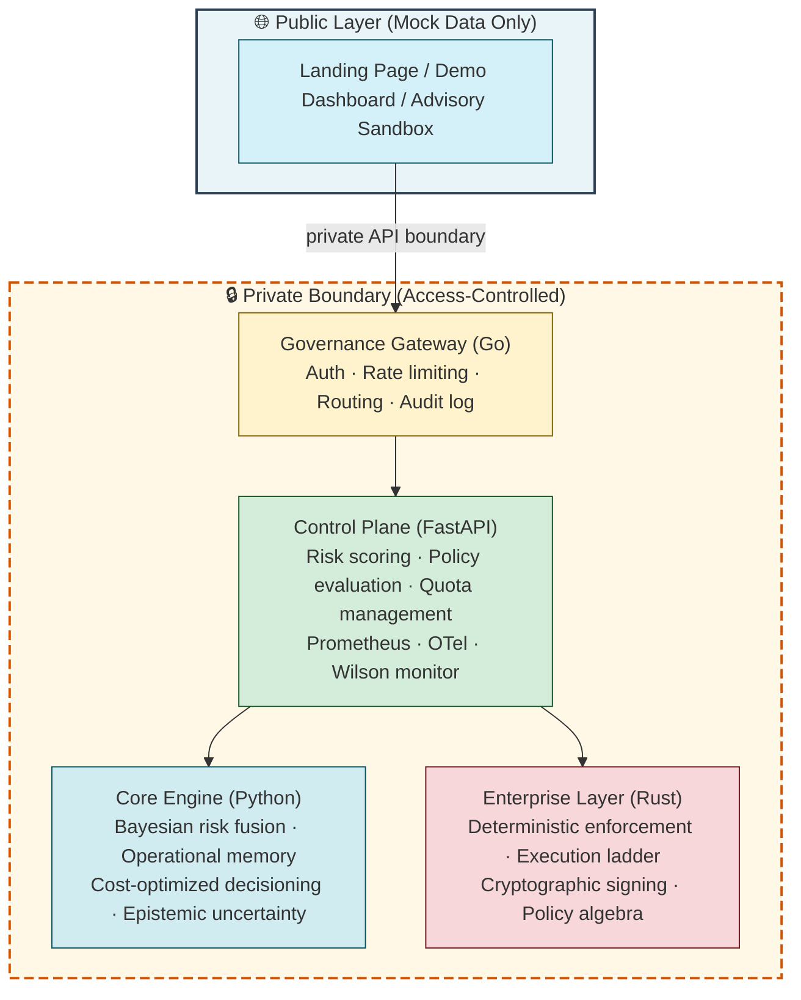

# Agentic Reliability Framework (ARF) – Stewarded Governance for AI Systems


**Auditable cloud governance powered by Bayesian intelligence.** Build reliable, observable, and self‑healing AI systems for real‑world infrastructure.

🔐 **The core ARF engine is access‑controlled and not publicly available.**  
It is available only to qualified pilots and enterprise customers under **outcome‑based pricing**.

👉 [ARF Control Center (public demo UI – mock data only)](https://arf-frontend-sandy.vercel.app/)

---

## 🎯 Our Mission

ARF makes AI operations **provably safe, auditable, and transparent**.  
We provide a **mathematically rigorous governance layer** for deterministic and probabilistic decision‑making in production AI systems.

- ✅ Enable **provably safe AI operations** in cloud, hybrid, and multi‑agent environments.
- 🧮 Deliver **Cost‑Optimized Decisioning** (hybrid Bayesian inference + calibrated risk scoring).
- 🔍 Offer **full traceability** through auditable logs, Operational Memory, and transparent decision records.
- 🧭 **Steward the framework** – not a free‑for‑all, but a protected, pilot‑first product.

---

## 📌 Publicly Listed Repositories (Reference Only)

These repositories are publicly visible for documentation and demo purposes.  
They **do not** contain the proprietary core engine.

| Repository | Description | Terms |
|------------|-------------|-------|
| [arf-spec](https://github.com/arf-foundation/arf-spec) | Canonical specification: data models, decision rules, API contracts | Shared under written terms |
| [arf-frontend](https://github.com/arf-foundation/arf-frontend) | Next.js demo dashboard (uses mock data only) | Shared under written terms |
| [pitch-deck](https://github.com/arf-foundation/pitch-deck) | Public overview and vision | Shared under written terms |

> 🔒 **All other repositories are private and access‑controlled.**  
> The core engine, API control plane, gateway, enterprise layer, research probes, and pricing calculator are **not publicly available**.

---

## 🚀 Ecosystem Overview (Public vs. Protected)

| Module | Purpose | Access |
|--------|---------|--------|
| **Public Specification** (`arf-spec`) | Data models, API contracts, decision rules | ✅ Public reference (shared under written terms) |
| **Public Demo UI** (`arf-frontend`) | Dashboard with mock data, showcases concepts | ✅ Public demo (shared under written terms) |
| **Protected Core Engine** | Continuous Risk Calibration, Operational Memory, governance loop | 🔒 Pilot / Enterprise only |
| **Protected API Control Plane** | FastAPI service with live endpoints | 🔒 Pilot / Enterprise only |
| **Enterprise Extensions** | Deterministic enforcement, audit trails, outcome‑based pricing | 🔒 Enterprise only |

---

## 🧠 Architecture

The diagram below shows the separation between public‑facing layers and the protected private components.




## 🔐 Key Capabilities (Protected Engine)

| Capability (Public Name) | Implementation (Protected) |
|--------------------------|----------------------------|
| Continuous Risk Calibration | Conjugate priors + HMC |
| Operational Memory | FAISS‑based retrieval with similarity search |
| Cost‑Optimized Decisioning | Expected loss minimisation with trade‑off costs |
| Epistemic Uncertainty (CUDL) | Shapley value decomposition + Wilson confidence gate |

> ⚠️ These capabilities are **not** exposed in the public demo. They exist only in the protected core engine, available under pilot or enterprise terms.

---

## 🎮 Live Demos (Sanitised / Mock Data)

- **UI Concept Demo** – [Hugging Face Space](https://huggingface.co/spaces/A-R-F/Agentic-Reliability-Framework-v4) – Interactive risk dashboard (mock data only)
- **Sandbox API** – [Mock endpoint](https://huggingface.co/spaces/A-R-F/ARF-Sandbox-API) – Returns mock responses, not real Bayesian inference. Interactive docs at `/docs`.

**Example sandbox call (returns mock data):**

```bash
curl -X POST https://a-r-f-arf-sandbox-api.hf.space/v1/evaluate \
  -H "Content-Type: application/json" \
  -d '{"service_name":"api","event_type":"latency","severity":"high"}'
```

The real engine is **not publicly accessible**.

---

## 🧑‍💻 Contributing (Public Repositories Only)

We accept **limited contributions** to publicly listed repositories (`arf-spec`, `arf-frontend`, `pitch-deck`) – bug fixes, documentation, demo improvements.  
**We do not accept pull requests against private core repositories.**

1. Open an issue describing your proposed change.
2. Wait for a maintainer to assign the issue.
3. Sign a Contributor License Agreement (CLA) if requested.
4. Submit a pull request referencing the issue.

All changes are reviewed and merged at the founder’s discretion.

For questions about the protected engine or pilot access, please **do not open issues** – use the contact details below.

---

## 📬 Pilot Access & Contact

The core ARF engine is **not open source** and **not publicly available**. To request pilot access (time‑limited free trial) or enterprise licensing, contact us directly:

| Method | Details |
|--------|---------|
| **Email** | `juan@arf-ai.com` |
| **LinkedIn** | [Juan Petter](https://www.linkedin.com/in/petterjuan/) |
| **Book a Call** | [30‑Min Consultation](https://calendly.com/petter2025us/30min) |

**When requesting access, please provide:**  
- Your full name and organisation  
- Use case description  
- Expected monthly incident volume  
- Cloud environment (AWS, Azure, GCP, on‑prem)

---

## 📜 License & Legal

- **Publicly listed repositories** (`arf-spec`, `arf-frontend`, `pitch-deck`) are shared under written terms – **not open source**.
- **All private repositories** (core engine, API control plane, gateway, enterprise, research, pricing calculator) are **proprietary and access‑controlled** – no license is granted for public use without a written agreement.
- See the [NOTICE](https://github.com/arf-foundation/.github/blob/main/NOTICE) file for full details.

> All public demos, dashboards, and APIs use **mock data only**.  
> The **core Bayesian engine** is **not publicly available** – it is protected and access‑controlled.

---

## ❓ Frequently Asked Questions (FAQ)

### What is ARF?
ARF is a governance layer that evaluates infrastructure decisions through a calibrated risk model. It recommends one of three actions — approve, deny, or escalate — together with a confidence indicator and a full audit trail. The core engine is access‑controlled and available only to qualified pilots.

### Is ARF publicly available?
No. ARF is proprietary and access‑controlled. All repositories are private, and access to code, specifications, and supporting materials is granted only through approved pilot or enterprise arrangements.

### What’s the difference between the demo and the real engine?
The demo is illustrative and uses mock or advisory data. It is designed to explain the workflow, not expose the protected engine. The real system is private and available only through pilot or enterprise access.

### How do I interpret the risk score?
The risk indicator is a value between 0 and 1. Higher values indicate higher estimated risk. The recommended action — approve, deny, or escalate — comes from a structured trade‑off model, not a fixed threshold, and includes a full, auditable justification.

### Can I use the sandbox API for production?
No. The sandbox API returns only mock data and is rate‑limited. It is intended for demonstration and testing only. For production use, you need pilot access to the real engine.

### What is Cost‑Optimized Decisioning?
The system evaluates the potential cost of each possible action based on configurable parameters and the current risk assessment. It then selects the action with the lowest expected impact, producing a human‑readable, auditable justification.

### How many requests per second can the real engine handle?
Performance depends on deployment scale. For pilot customers, we provide guidance based on your expected volume. Enterprise customers receive SLAs and dedicated capacity.

### What data is stored?
The engine stores audit logs (decisions, risk scores, justifications) for compliance. No raw customer data is retained beyond what is required for the audit trail. Contact us for detailed retention policies.

### How can I engage with ARF?
ARF is not accepting public contributions. Collaboration is handled through private pilot, partner, or enterprise channels. Reach out to discuss possible involvement.

### Where do I report a bug in the demo?
Contact us directly through the support or pilot request channel. We review issues from approved users and pilot participants.

### Is there a community Slack?
There is an invite‑only Slack workspace for pilot customers and approved collaborators. [Join here](https://join.slack.com/t/arf-gnv9451/shared_invite/zt-3t2omlgwg-Zf5_jmy9EIU~b51kMJ8Zdg).

### What license governs ARF materials?
ARF materials are proprietary and access‑controlled. Any access to code, specifications, or supporting materials is governed by written agreement and approved use terms.

### Can I use the real engine in a commercial product?
Yes, under a pilot or enterprise agreement. Outcome‑based pricing applies. Contact us for details.

---

## 🗺️ Roadmap (Protected Development)

The following capabilities are under active development for pilot and enterprise customers:

| Feature | Target Availability | Description |
|---------|---------------------|-------------|
| Enhanced policy algebra | Q3 2026 | AND/OR/NOT combinators with temporal constraints |
| Multi‑region audit federation | Q4 2026 | Cross‑region audit trail aggregation |
| Real‑time anomaly detection | Q1 2027 | Streaming ML for pre‑decision alerts |
| Cost‑based auto‑remediation | Q2 2027 | Automated healing actions within policy bounds |

> Note: The roadmap is shared with qualified pilots under written terms. Dates are estimates and subject to change.

---

## 🔒 Security & Compliance

- **Deterministic enforcement** – Every policy decision is mechanically enforced; no silent overrides.
- **Immutable audit logs** – All decisions are recorded with cryptographic signatures.
- **Access control** – Role‑based access control (RBAC) with SSO integration for enterprise.
- **Data privacy** – No raw customer data retained; only anonymised risk metrics and audit trails.
- **Compliance readiness** – Designed to support SOC2, ISO 27001, and GDPR requirements.

Pilot customers receive a full security architecture review and compliance package upon agreement.

---

## 📊 Support Channels

| Tier | Access | Response SLA |
|------|--------|---------------|
| Sandbox (public) | Community Slack, public issues | Best effort |
| Pilot | Email, private Slack, scheduled office hours | < 24 hours (business days) |
| Enterprise | Dedicated TAM, phone support, private Slack | < 4 hours (24/7) |

For pilot and enterprise support, contact `support@arf-ai.com` or use the provided private channels.

---

## 📝 Versioning & Changelog

- **Public specification** (`arf-spec`) is versioned and changes are documented in its [CHANGELOG](https://github.com/arf-foundation/arf-spec/blob/main/CHANGELOG.md).
- **Protected engine** versions are shared with pilot customers under written terms. No public changelog is provided.

Current protected engine version: **4.2.0** (available to qualified pilots).

---

## 🌐 Related Resources

- [ARF Control Center (demo UI)](https://arf-frontend-sandy.vercel.app/)
- [Public Specification (arf-spec)](https://github.com/arf-foundation/arf-spec)
- [Pilot Request Form](https://arf-ai.com/signup)
- [Slack Community (invite‑only for pilots)](https://join.slack.com/t/arf-gnv9451/shared_invite/zt-3t2omlgwg-Zf5_jmy9EIU~b51kMJ8Zdg)

---

## 📄 Legal Footer

© 2026 ARF Foundation. All repositories are private and access‑controlled. The core engine is proprietary. Selected materials are shared under written terms with qualified pilots and enterprise customers. Unauthorised access, copying, or distribution is prohibited.

---

*Stewarded by the founder – pilot‑first, outcome‑based pricing.*
