cat > /tmp/ARF_ORG_README.md << 'EOF'
# Agentic Reliability Framework (ARF) – Stewarded Governance for AI Systems


**Auditable cloud governance powered by Bayesian intelligence.** Build reliable, observable, and self‑healing AI systems for real‑world infrastructure.

🔐 **The core ARF engine is access‑controlled and not publicly available.**  
It is available only to qualified pilots and enterprise customers under **outcome‑based pricing**.

👉 [ARF Control Center (public demo UI – mock data only)](https://arf-frontend-sandy.vercel.app/)

---

## 🎯 Our Mission

ARF makes AI operations **provably safe, auditable, and transparent**.  
We provide a **mathematically rigorous governance layer** for deterministic and probabilistic decision‑making in production AI systems.

- ✅ Enable **provably safe AI operations** in cloud, hybrid, and multi‑agent environments.
- 🧮 Deliver **Cost‑Optimized Decisioning** (hybrid Bayesian inference + calibrated risk scoring).
- 🔍 Offer **full traceability** through auditable logs, Operational Memory, and transparent decision records.
- 🧭 **Steward the framework** – not a free‑for‑all, but a protected, pilot‑first product.

---

## 📌 Publicly Listed Repositories (Reference Only)

These repositories are publicly visible for documentation and demo purposes.  
They **do not** contain the proprietary core engine.

| Repository | Description | Terms |
|------------|-------------|-------|
| [arf-spec](https://github.com/arf-foundation/arf-spec) | Canonical specification: data models, decision rules, API contracts | Shared under written terms |
| [arf-frontend](https://github.com/arf-foundation/arf-frontend) | Next.js demo dashboard (uses mock data only) | Shared under written terms |
| [pitch-deck](https://github.com/arf-foundation/pitch-deck) | Public overview and vision | Shared under written terms |

> 🔒 **All other repositories are private and access‑controlled.**  
> The core engine, API control plane, gateway, enterprise layer, research probes, and pricing calculator are **not publicly available**.

---

## 🚀 Ecosystem Overview (Public vs. Protected)

| Module | Purpose | Access |
|--------|---------|--------|
| **Public Specification** (`arf-spec`) | Data models, API contracts, decision rules | ✅ Public reference (shared under written terms) |
| **Public Demo UI** (`arf-frontend`) | Dashboard with mock data, showcases concepts | ✅ Public demo (shared under written terms) |
| **Protected Core Engine** | Continuous Risk Calibration, Operational Memory, governance loop | 🔒 Pilot / Enterprise only |
| **Protected API Control Plane** | FastAPI service with live endpoints | 🔒 Pilot / Enterprise only |
| **Enterprise Extensions** | Deterministic enforcement, audit trails, outcome‑based pricing | 🔒 Enterprise only |

---

## 🧠 Architecture

```mermaid
%%{init: {'theme': 'dark', 'themeVariables': {
  'background': '#0d1117',
  'primaryColor': '#1f6feb',
  'primaryTextColor': '#ffffff',
  'primaryBorderColor': '#3b82f6',
  'lineColor': '#58a6ff',
  'secondaryColor': '#238636',
  'tertiaryColor': '#6e40c9',
  'clusterBkg': '#161b22',
  'clusterBorder': '#f0883e',
  'titleColor': '#ffffff'
}}}%%
flowchart TB
    subgraph Public["🌐 PUBLIC LAYER – Mock Data Only"]
        direction TB
        A["<b>Landing Page</b><br/>www.arf-ai.com"]
        B["<b>Demo Dashboard</b><br/>Mock risk visualisation"]
        C["<b>Advisory Sandbox API</b><br/>curl mock responses"]
    end

    subgraph Boundary["🔒 PRIVATE BOUNDARY – Access‑Controlled"]
        direction TB
        subgraph Gateway["Governance Gateway (Go)"]
            G["Auth · Rate limiting · Request routing<br/>Audit logging · TLS termination"]
        end
        subgraph ControlPlane["Control Plane (FastAPI)"]
            CP["Risk scoring · Policy evaluation<br/>Quota management · Wilson monitor<br/>Prometheus metrics · OTel tracing"]
        end
        subgraph Engine["Protected Core Components"]
            direction LR
            subgraph Core["Core Engine (Python)"]
                CE["Bayesian risk fusion<br/>Operational memory<br/>Cost‑optimized decisioning<br/>Epistemic uncertainty (CUDL)"]
            end
            subgraph Enterprise["Enterprise Layer (Rust)"]
                EL["Deterministic enforcement<br/>Execution ladder<br/>Cryptographic signing<br/>Policy algebra (verified)"]
            end
        end
    end

    Public -->|"private API boundary<br/>(no real data)"| Gateway
    Gateway --> ControlPlane
    ControlPlane --> Core
    ControlPlane --> Enterprise

    style Public fill:#161b22,stroke:#58a6ff,stroke-width:2px,color:#ffffff
    style Boundary fill:#161b22,stroke:#f0883e,stroke-width:2px,stroke-dasharray: 8 4
    style Gateway fill:#6e40c9,stroke:#a371f7,stroke-width:2px,color:#ffffff
    style ControlPlane fill:#238636,stroke:#3fb950,stroke-width:2px,color:#ffffff
    style Core fill:#1f6feb,stroke:#3b82f6,stroke-width:2px,color:#ffffff
    style Enterprise fill:#da3633,stroke:#f85149,stroke-width:2px,color:#ffffff
    style Engine fill:none,stroke:none
    linkStyle default stroke:#58a6ff,stroke-width:2px
```



cat >> /tmp/ARF_ORG_README_PART2.md << 'EOF'
## 🔐 Key Capabilities (Protected Engine)

| Capability (Public Name) | Implementation (Protected) |
|--------------------------|----------------------------|
| Continuous Risk Calibration | Conjugate priors + HMC |
| Operational Memory | FAISS‑based retrieval with similarity search |
| Cost‑Optimized Decisioning | Expected loss minimisation with trade‑off costs |
| Epistemic Uncertainty (CUDL) | Shapley value decomposition + Wilson confidence gate |

> ⚠️ These capabilities are **not** exposed in the public demo. They exist only in the protected core engine, available under pilot or enterprise terms.

---

## 🎮 Live Demos (Sanitised / Mock Data)

- **UI Concept Demo** – [Hugging Face Space](https://huggingface.co/spaces/A-R-F/Agentic-Reliability-Framework-v4) – Interactive risk dashboard (mock data only)
- **Sandbox API** – [Mock endpoint](https://huggingface.co/spaces/A-R-F/ARF-Sandbox-API) – Returns mock responses, not real Bayesian inference. Interactive docs at `/docs`.

**Example sandbox call (returns mock data):**

```bash
curl -X POST https://a-r-f-arf-sandbox-api.hf.space/v1/evaluate \
  -H "Content-Type: application/json" \
  -d '{"service_name":"api","event_type":"latency","severity":"high"}'
```

