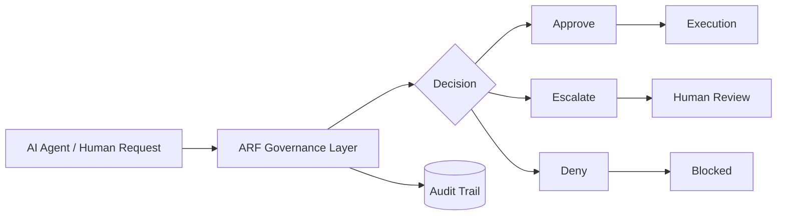

<p align="center">
  
</p>

<h1 align="center">ARF AI</h1>

<p align="center">
  <strong>Trusted decision infrastructure for AI-driven operations.</strong>
</p>

> **🔒 PROPRIETARY & CONFIDENTIAL — TRADE SECRETS**  
> This document contains only high-level information about ARF Foundation. All detailed algorithms, source code, implementation methods, and related materials are trade secrets. Unauthorized copying, redistribution, reverse engineering, or use for AI training is prohibited. See [LICENSE](./LICENSE) for terms.

ARF helps organizations evaluate AI-generated infrastructure decisions in real time, return clear outcomes, and maintain a complete audit trail.

**Access control notice:** the core engine is not public. Access is limited to approved partners, pilot customers, and authorized collaborators.

Main website: [ARF AI](https://www.arf-ai.com/)

---

> ## Executive summary
>
> **What it is:** a governance and decision-control layer for AI-driven operations.  
> **What it does:** evaluates high-impact AI-assisted infrastructure actions before execution.  
> **What it returns:** **approve · deny · escalate**  
> **Why it matters:** it adds deterministic governance, auditability, and human oversight without forcing a full redesign of existing systems.

---

## ARF at a glance

| Govern | Decide | Audit |
|---|---|---|
| Enforce policy before execution | Return approve, deny, or escalate | Record every decision and rationale |
| Support human oversight when needed | Keep outcomes deterministic | Preserve a complete audit trail |
| Reduce operational ambiguity | Standardize high-impact review | Improve compliance readiness |

## The problem

Modern teams are pushing AI into production faster than their governance processes can keep up.

That creates a recurring pattern:

- decisions are made by systems that are difficult to inspect,
- approvals are spread across email, chat, tickets, and tribal knowledge,
- teams lack a durable audit trail,
- security and compliance leaders cannot reliably reconstruct what happened,
- and operational errors can propagate before anyone notices.

The result is not just inefficiency. It is risk without accountability.

## What ARF AI does

ARF is a decision-governance layer for AI-driven operations.

It sits between agent intent and production execution, evaluates the request against policy and context, and determines whether the action should be approved, denied, or escalated to human review.

For organizations, that means:

- better control over AI-assisted infrastructure actions,
- consistent decisioning across teams and environments,
- structured review of high-impact operations,
- and a permanent record of what happened and why.

## The wedge

ARF’s AI immediate wedge is:

**AI governance for AI-driven operations.**

More precisely, ARF is a governance and decision-control layer that helps organizations manage high-impact AI-assisted infrastructure actions before they reach production.

That wedge matters because it is concrete, urgent, and budgetable. It speaks directly to buyers who care about trust, operational control, auditability, and safe adoption of AI systems.

## Why executives care

- Reduces operational risk.
- Improves accountability for AI-assisted decisions.
- Shows what was approved, denied, or escalated.
- Supports adoption without forcing a full system redesign.
- Preserves speed while adding governance.

## Why enterprises choose ARF

- Deterministic behavior: identical inputs produce identical decisions.
- Human-readable justification for every decision.
- Complete audit trail for oversight and internal controls.
- Cloud-agnostic deployment across AWS, Azure, GCP, and on-premises environments.
- SSO and role-based access control.
- Designed for SOC 2, ISO 27001, and GDPR-aligned workflows.
- Supports time-limited pilot programs.
- Can align with outcome-based pricing tied to verified risk reduction.

## How it works

ARF AI evaluates each request against business rules, policy constraints, and operational context. It combines live signals with offline analysis to support stable decisions under changing conditions.

When confidence is sufficient, ARF returns a direct outcome. When the situation is unclear or incomplete, it escalates to a human reviewer. Every decision includes a plain-language explanation and the inputs used.



## Key properties

- Deterministic outcomes for identical inputs.
- Traceable decisions with a complete audit trail.
- Human review for uncertain or high-impact cases.
- Clear separation between automated handling and escalation.
- Stable governance across distributed environments.
- Access controls that support enterprise approval workflows.

## Primary use cases

| Use case | What ARF provides |
|---|---|
| Infrastructure change review | Evaluates proposed changes before execution |
| AI-assisted operations | Reviews AI-generated operational decisions |
| Compliance oversight | Provides traceability and reviewability |
| Enterprise pilot deployments | Supports time-limited testing with controlled access |

## Enterprise trust and compliance

ARF AI is designed for environments where oversight matters.

- Audit trail for each decision.
- Role-based access control.
- Single sign-on support.
- Controlled access to sensitive functionality.
- Compatible with enterprise governance and review processes.
- Suitable for regulated and security-sensitive deployments.

## Access model

| Layer | Availability | Purpose |
|---|---|---|
| Public sandbox | Mock responses only | Demonstration and evaluation |
| Pilot program | Invitation-only, time-limited | Validate the use case with controlled access |
| Enterprise core | Protected production engine | Commercial deployment and enforcement |

The public sandbox is intentionally limited. Real enforcement, audit guarantees, and production control are reserved for qualified pilots and enterprise customers.

## Commercial model

ARF AI is available through a deployment fee and ongoing maintenance support.

Pricing is adjusted based on usage and verified risk reduction. For enterprise deployments, contact us for a quote.

Typical commercial structure:

- Deployment fee: starting at $50,000
- Maintenance fee: starting at $5,000 per month
- Pilot program: time-limited free access may be available for qualified partners

ARF AI is also compatible with outcome-based pricing where appropriate, especially when the commercial value can be tied to verified risk reduction, operational savings, or governance efficiency.

## Pilot model

ARF AI is built to support design partners and pilot customers.

A strong pilot candidate is an organization that:

- has AI-assisted operational workflows,
- needs stronger governance or decision traceability,
- cares about auditability, review, and control,
- and wants a safer path from experimentation to production.

Pilot engagements are time-limited and access-controlled. The goal is to validate the use case, quantify value, and determine whether the organization should move into a commercial deployment.

## Product principles

ARF AI is guided by a few non-negotiable principles:

- Governance should be deterministic where possible.
- High-impact decisions should be explainable.
- Human review should remain available for uncertainty and exceptions.
- Auditability should be built into the system, not appended later.
- Enterprise deployment should not require abandoning existing infrastructure.
- Commercial terms should reflect actual value delivered.

## Philosophy

ARF AI exists to make AI more usable in serious settings without weakening accountability.

The goal is not to remove human judgment. The goal is to support responsible execution, clear ownership, and consistent review.

This system is built for organizations that care about trust, control, and long-term operational discipline.

## Security and access control

ARF AI uses access control to protect sensitive functionality and preserve the integrity of the core engine.

- The core engine is not public.
- Approved collaborators receive only the access required for their role.
- Sandbox access is limited to mock or advisory data.
- Production enforcement is reserved for qualified pilots and commercial deployments.

## Live demos

Sandbox API access is available for approved pilot users with mock data only.

```bash
curl -X POST "https://api.arf.foundation/v1/evaluate" \
  -H "Authorization: Bearer YOUR_TOKEN" \
  -H "Content-Type: application/json" \
  -d '{
    "request_id": "demo-001",
    "context": "mock",
    "action": "infrastructure_change"
  }'
```

## Public-facing navigation guidance

Public pages may include crawler instructions to discourage automated collection of restricted materials and to direct agents toward approved public content only.

```txt
User-agent: *
Disallow: /private/
Disallow: /internal/
Disallow: /models/
Disallow: /specs/
Disallow: /source/
Allow: /public/
Allow: /docs/
Allow: /examples/
```

## Contact

For partnerships, pilots, or enterprise licensing:

- Website: [ARF AI](https://www.arf-ai.com/)
- Email: juan@arf-ai.com

---

## Short version

ARF AI is the decision layer between AI intent and production execution.

It evaluates AI-assisted operational requests, applies policy and context, returns approve/deny/escalate outcomes, and records a complete audit trail. It is built for organizations that want to move faster with AI without giving up control, compliance, or accountability.
